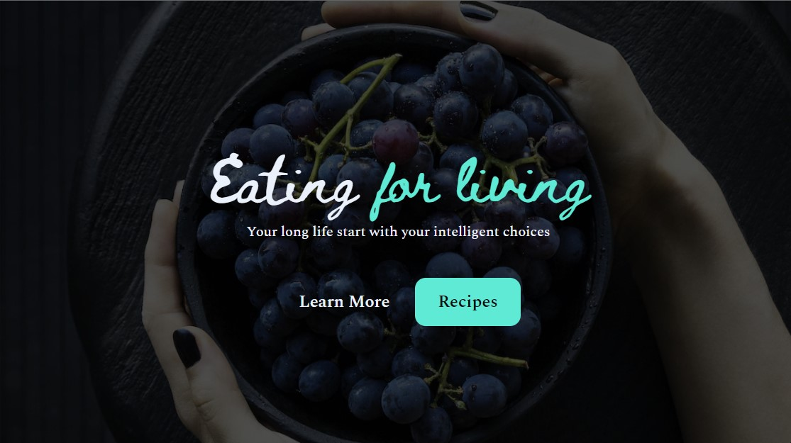

<h1 align="center"> 
Healthy Recipes Landing Page </h1>

Projeto realizado no evento online "Jornada do Zero à Primeira Vaga", organizado pela Rocketseat.

  

---

## 🚀 Tecnologias

Esse projeto foi desenvolvido com as seguintes tecnologias:

- HTML e CSS
- Figma

---

## 💻 Projeto

A criação dessa landing page faz parte do segundo desafio proposto durante a jornada.

---

## 🔖 Layout

Você pode visualizar o layout do projeto através [DESSE LINK](https://www.figma.com/community/file/1216014509044898198). É necessário ter conta no [Figma](https://figma.com) para acessá-lo.